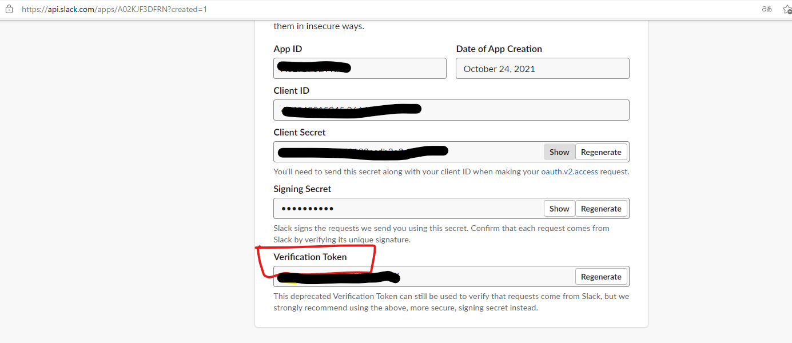

# Slackbot

slackbot project

## Usage

### Run
- Setting `.env` file
- Run `make run`

### Build
- Setting `.env` file
- Run `make bulid`

### Test
- run `make test`

## Environment

### SLACK_VERIFICATION_TOKEN
- 